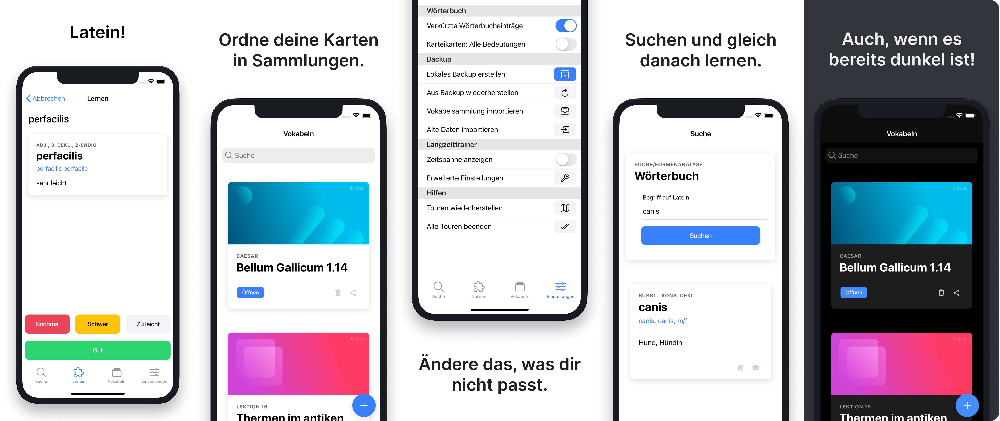

<br/>

# Discite

<a href="#">
  
</a>
<a href="#">
  
</a>
<a href="#">
  
</a>
<a href="https://discord.gg/7DKtGASpq4">
  
</a>

<br />

<a href="#">
  
</a>
<a href="#">
  
</a>
<a href="#">
  
</a>

## Was ist Discite?

Viele Vokabel- und Karteikartenapps bieten nicht das, was man zum effektiven Lernen von Latein braucht. Sie können meist die Stammformen der Wörter nicht mit aufnehmen. Discite ist genau für diesen Anwendungszweck optimiert: Die App zeigt Stammformen, Konjugationen, Deklinationen etc. an und hat einen smarten Karteikarten-Editor, der das eingegebene Wort erkennt und automatisch die Felder für Stammformen, Bedeutungen und vieles mehr ausfüllt und einem die Tipparbeit am Smartphone erspart.

Eine ausführliche Anleitung und Dokumentation findet man hier: [Discite](https://www.craft.do/s/3kweqFq2F1jjpf) \
Eine etwas längere Projektbeschreibung findet man hier: [Projektseite](https://paul.hoerenz.com/project/discite)

## Installation

<div align="center">
  <a href="https://play.google.com/store/apps/details?id=de.xp4u1.discite">
    
  </a>
  <a href="https://apps.apple.com/app/id1566607319">
    
  </a>
  <a href="https://discite.hoerenz.com">
    
  </a>
</div>

<br />

Mit folgenden Schritten kann man Discite auch lokal auf dem eigenen Rechner starten:

```
# Discite-Repo klonen
$ git clone git@github.com:xp4u1/discite

# Pakete herunterladen
$ yarn

# App im Entwicklungsmodus starten
$ yarn start
```

Man kann nun Discite im Browser unter der Adresse `localhost:3000` aufrufen.

## Screenshots


